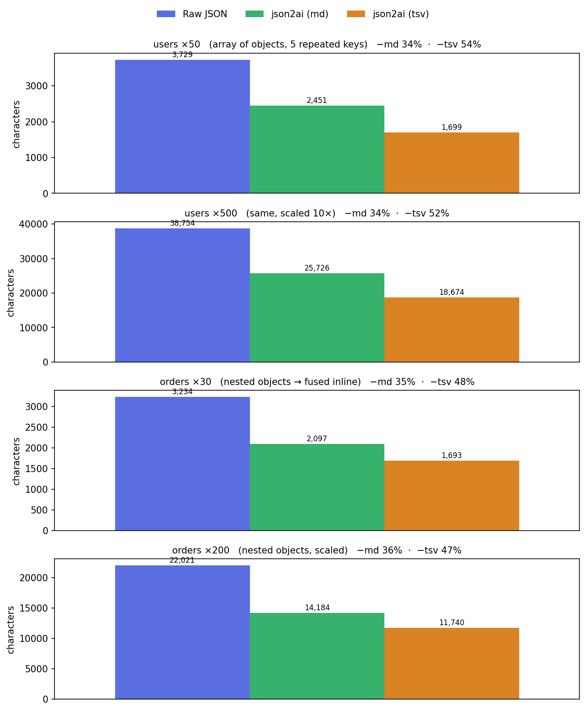

# json2ai

Convert JSON into a compact, AI-friendly text format. Reduces token usage and
formats nested data for readable consumption by LLM-based tools. Optionally wrap
output in a Markdown fenced code block.

## Install

```bash
npm install json2ai
```

## Usage

```ts
import json2ai from "json2ai";

const out = json2ai({
  user: { id: 1, name: "ryuyx", active: true },
  tags: ["ts", "node"],
  users: [
    { id: 1, name: "a" },
    { id: 2, name: "b" },
  ],
});
```

Produces:

```text
user:
 id: 1
 name: ryuyx
 active: true
tags:
 ts, node
users:
 | index | id | name |
 | --- | --- | --- |
 | 0 | 1 | a |
 | 1 | 2 | b |
```

Arrays of homogeneous objects are rendered as a Markdown table (field names emitted
once, one row per item) to avoid repeating the same keys and wasting tokens —
friendlier for LLMs than raw JSON. Nested sub-objects and sub-arrays are fused into
their cell as compact inline notation (`{u:3 r:{id:x}}`) instead of nesting deeper.

## Token savings

By dropping JSON's syntax overhead (quotes, braces, colons, commas) and emitting
repeated structural keys only once, `json2ai` shrinks the payload a well-known model
needs to read. Measured in characters (a reasonable token proxy), four representative
inputs — arrays of objects with repeated keys and nested records — shrink by about
one-third in `md` format and by roughly half in the more compact `tsv` format:



Per-sample reduction: `users ×50` −34% md / −54% tsv, `users ×500` −34% / −52%,
`orders ×30` −35% / −48%, `orders ×200` −36% / −47%. Savings grow with redundancy:
the more repeated keys and nested structure a payload has, the more a reader can
drop. Regenerate the chart with `python3 scripts/plot_tokens.py`.

## API

`json2ai(value, options?) => string`

### Options

| Option           | Type       | Default  | Description                                                       |
| ---------------- | ---------- | -------- | ----------------------------------------------------------------- |
| `indent`         | `string`   | `" "`    | Indentation string for nested objects.                            |
| `format`         | `"md"|"tsv"`| `"md"`  | Table format for object arrays. `"md"` (friendly, +tokens) or `"tsv"` (compact, −tokens). |
| `maxArrayItems`  | `number`   | —        | Truncate large arrays, summarizing skipped items with a count.    |
| `wrapInCodeBlock`| `boolean`  | `false`  | Wrap output in a fenced Markdown code block.                      |
| `codeBlockLang`  | `string`   | `"text"` | Fence language for `wrapInCodeBlock`.                             |
| `omit`           | `string[]` | `[]`     | Key names to drop (e.g. secrets). Matches key names at any depth. |

## License

MIT